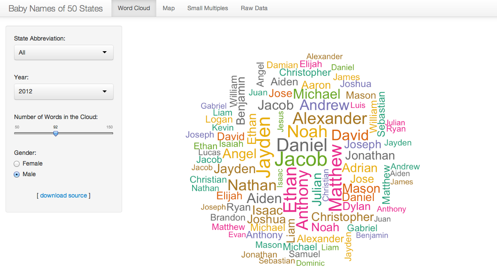
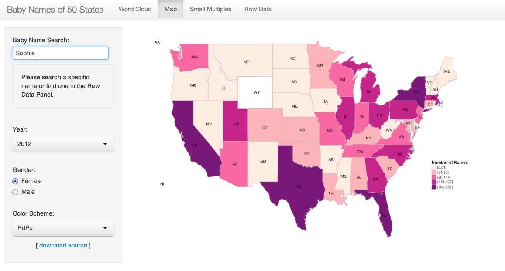
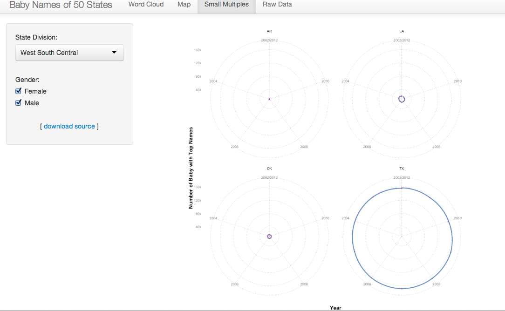
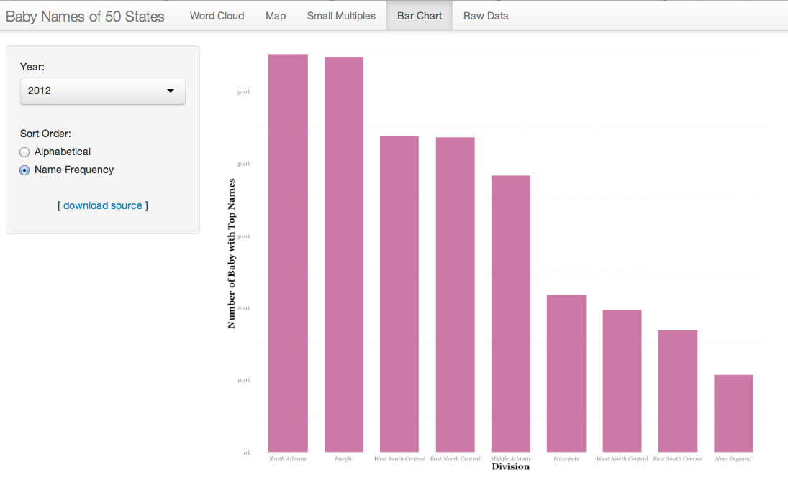
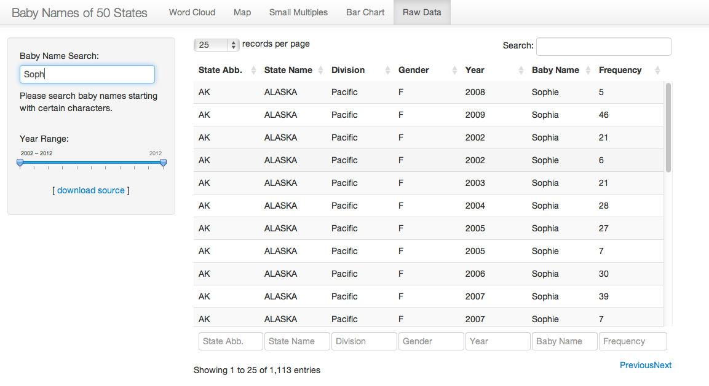

Visualization: Top 1,000 Baby Names of latest 10 years in US 
==============================

| **Name**  | Katherine Zhao  |
|----------:|:-------------|
| **Email** | mzhao12@dons.usfca.edu |

## Instructions ##

The following packages must be installed prior to running this code:

- `ggplot2`
- `shiny`
- `scales`
- `RColorBrewer`
- `wordcloud`
- `Hmisc`
- `ggmap`
- `maptools`
- `plyr`

To run this code, please enter the following commands in R:

```
library(shiny)
shiny::runGitHub('DataVisualization', 'katherinez22', subdir = 'Visualize_Baby_Names')
```

This will start the `shiny` app. See below for details on how to interact with the visualization.

## Data Set ##

In this project, I visualized the top 1,000 names of baby born during 2002 and 2012 in 50 States in U.S. The dataset I obtained was from the Official Social Security Website `http://www.ssa.gov/OACT/babynames/limits.html`. The original data were stored in `TXT` files with each file storing frequency of baby name from 1910 to 2012. Due to the storage limitation of my GitHub repository, I only used data from 2002 to 2012 for this visualization. 

Except merging the data from `TXT` files into a `csv` file, I also combined the State Divisions (New England, Middle Atlantic, South Atlantic, East South Central, West South Central, East North Central, West North Central, Mountain, and Pacific) from the `US State Facts and Figures` dataset stored in R. 

In addition, I merged the longitude and latitude of each state to my dataset to visualize the frequency of baby name in the U.S map. Please find the further discussion below.

After extracting and combining data from various sources, I had the dataset with 988,973 rows and 7 columns for my visualization. The 7 columns include: `State` represents the state abbreviation, `region` represents the state name, `Division` represents the state division, `Sex` represents baby's gender, `Year` represents which year the name was collected, `Name` represents baby name, and `Number` represents the name frequency. Also, an extended dataset containing over 1 million rows and 12 columns is prepared for map visualization. 

## Discussion ##

In general, I chose to implement four distinct visualizations of this baby names data set and integrated all four visualizations into a shiny app. There are five panels in the shiny app. They are `Word Cloud`, `Map`, `Small Multiples`, `Bar Chart` and `Raw Data`. Each panel has its own filters and control options. Please find the detailed discussions about each technique as bellows.

## Panel 1: Word Cloud ##

### Technique ###

The first technique I chose to implement is Word Cloud. Since the data set includes top 1,000 baby names in 50 states, word cloud is a wonderful visualization for these names because it has a great readability of words in the cloud and is easy to provide users a general impression about which names are the most popular ones. 

To get the appropriate data for visualization, I mapped the data through the following steps:

1. Filtered the data by `Sex` and `State` to obtain a subset of data.
2. Aggregated the `Number` by `Sex`, `Year` and `Name`.

After mapping the data, I obtained a subset of data containing 4 columns: `Number`, `Sex`, `Year` and `Name`. Then I visualized the baby names by their frequency in the word cloud. 

### Interactivity ###

In the `Word Cloud` panel, a user has the option to visualize the word cloud of baby names. Specifically, three filters including state, gender and year allow a user to focus on his interested subset of data. Also, a user can vary the number of words he would like to view within the cloud. In addition, the source code can be downloaded from my GitHub repository through the `download source` link.

By viewing this word cloud, a user could easily find out which names are the most frequently used in different states or across the country within a specific year. For example, `Mason`, `William`, `Ethan` and `Jacob` are the most frequently used boy names in the U.S. as showing in the following graph.


## Panel 2: Map ##

### Technique ###

The second technique I chose to implement is Map. Since the state information is included in the data set, map is a powerful implementation to visualize the frequency of name.

To get the appropriate data for visualization, I mapped the data through the following steps:

1. filtered the data by `Name`, `Year` and `Gender` to obtain a subset of data. When filtering by name, the name has to be chosen as a specific baby name already existed in the dataset rather than a random name starting with arbitrary characters.

2. merged the subset of data obtained from the first step with a map data, which includes state's longitude, latitude, group, order, region and sub region, by `region`. The map data was obtained using `map_data` function in `ggplot2`. Since I have a very large dataset, this step takes a very long time to process. Therefore, I only performed the merging on the subset of data. 

After mapping the data, I obtained a subset of data containing 12 columns: `State`, `region`, `Division`, `Sex`, `Year`, `Name`, `Number`, `long`, `lat`, `group`, `order` and `subregion`. Then I split the frequency of name into 5 intervals and visualized density of a specific name by its geographic location. 

### Interactivity ###

In the `Map` panel, a user could search a specific baby name in the search box, which is not case non-sensitive. Searching `Sophie` and `sophie` would give the same result in this case. Also, a hint under the search box is provided to remind him to search a specific name or find one in the `Raw Data` panel. Also, the user has the option to filter the visualization by year and gender, and view the map with different color pallets. As same as other panels, the user could download the source code from my GitHub repository through the `download source` link.

With this visualization, a user can explore the relationship between the statistics of baby name and their geographical information. For example, a user could find out girls in which state were named as `Sophie` more frequently than the other states. In this particular example, the name `Sophie`has larger density in California, Texas, Florida, and New York in 2012. Also, there is no girl was named as `Sophie` in Wyoming in this year.



## Small Multiples ##

### Technique ###

The third technique I chose to implement is Small Multiples. Each chart in this small multiples plot is a radar chart of each state. By viewing this plot, a user could have a better understanding of the number of baby with most frequent names in various states. 

To get the appropriate data for visualization, I mapped the data through the following steps:

1. Filtered the data by `Name` and `Gender` to obtain a subset of data. 
2. Aggregated the `Number` by `State` and `Year`.

After mapping the data, I obtained a subset of data with 3 columns: `State`, `Year` and `Number`. Then I visualized the radar chart for each state and wrap the charts by state division.

In the radar chart, the y-axis is the total number of babies who have these top 1,000 ranked names and the x-axis or the axis in the circle is the year. 

### Interactivity ###

In the `Small Multiples` panel, a user has the option to choose which state division and gender he would like to view in the graph. By default, he will see the radar charts of 50 states for both girls and boys. As same as other panels, the user could download the source code from my GitHub repository through the `download source` link.

For example, in the West South Central division, there are four states within this division. Texas has the largest number of baby with top names over the 10 years. Also, the numbers of babies are very consistent for all four states. 



## Bar Chart ##

### Technique ###

The Fourth technique I chose to implement is Bar Chart. In the small multiples above, a user had detailed information about the total number of babies with top names of each state over 10 years in different divisions. In this bar chart, he would have a even better understanding about the total number of babies with top names in different divisions in each year. 

To get the right data for visualization, I mapped the data in the following steps:

1. Filtered the data by `Year` to obtain a subset of data. 
2. Aggregated the `Number` by `Division`.

After mapping the data, I obtained a subset of data with 2 columns: `Division` and `Number`. Then I visualized the bar chart of total number of babies with top names for 9 state divisions.

### Interactivity ###

In the `Bar Chart` panel, a user has the option to choose which year he would like to view the total number of babies of 9 different divisions. Also, he could choose to view the bars in an alphabetical order or sorted order by name frequency. As same as other panels, the user could download the source code from my GitHub repository through the `download source` link.

For example, when sorting the bars by name frequency, the user could realize the order of bars in the plot has been changed and find out the South Atlantic division has the largest number of babies with top names among all nine divisions in 2012. 



## Raw Data ##

### Technique ###

There are two purposes for showing the raw data here. First, a user could search a specific baby name from this table if he doesn't come up with one to visualize it in the `Map` panel. Second, the user could have a good understanding about what data he is visualizing. 

To get the appropriate data for visualization, I mapped the data through the following steps:

1. Filtered the data by `Name` to obtain a subset of data. Different to the search box in the `Map` panel, here the user could search names starting with certain characters. 

2. Subset the data obtained in the first step above in various year ranges.

After mapping the data, I obtained a subset of data with 7 columns: `State`, `region`, `Division`, `Sex`, `Year`, `Name` and `Number`.

### Interactivity ###

In the `Raw Data` panel, a user could search, filter and sort the raw data. In the search box, a user could search baby names starting with certain characters. By moving the slide bars, he could adjust year ranges for searching the data. There are also other search boxes and filter bars in the table to allow user performing various filters. 

By default, this table lists 25 results on each page in default. The user could view the data on the next page by clicking on the `Next` button or view more results on each page by choosing the number of records per page. 




