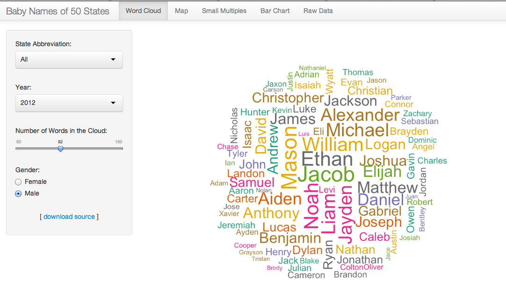
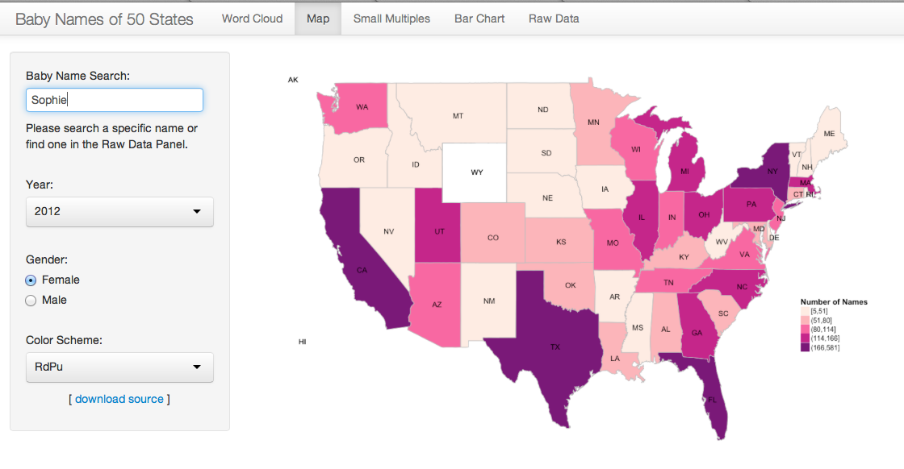
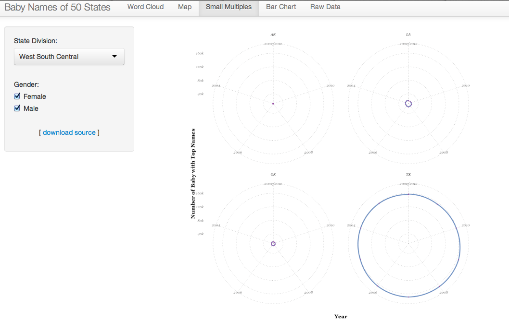

Visualization: Top 1,000 Baby Names of latest 10 years in US 
==============================

| **Name**  | Katherine Zhao  |
|----------:|:-------------|
| **Email** | mzhao12@dons.usfca.edu |

## Instructions ##

The following packages must be installed prior to running this code:

- `ggplot2`
- `shiny`
- `scales`
- `RColorBrewer`
- `wordcloud`
- `Hmisc`
- `ggmap`
- `maptools`
- `plyr`

To run this code, please enter the following commands in R:

```
library(shiny)
shiny::runGitHub('msan622', 'katherinez22', subdir = 'final-project')
```

This will start the `shiny` app. See below for details on how to interact with the visualization.

## Data Set ##

In this project, I visualized the top 1,000 names of baby born during 2002 and 2012 in U.S 50 States. The dataset I obtained was from the Official Social Security Website `http://www.ssa.gov/OACT/babynames/limits.html`. The original data was stored in `TXT` files with each file storing baby name frequency from 1910 to 2012. Due to the storage limitation of my GitHub repository, I used only data from 2002 to 2012 for this visualization. 

Except merging the data from `TXT` files to a `csv` file, I also combined the State Divisions (New England, Middle Atlantic, South Atlantic, East South Central, West South Central, East North Central, West North Central, Mountain, and Pacific) from the `US State Facts and Figures` dataset stored in R. 

In addition, I merged the longitude and latitude of each state to my dataset to visualize the baby name frequency in the U.S map. Please find the further discussion below.

After extracting and combining data from various sources, I had the dataset with 988,973 rows and 7 columns (over 1 million rows and 12 columns in the dataset using for map visualization).

## Interactivity ##

There are four panels in the shiny app. They are `Word Cloud`, `Map`, `Small Multiples`, and `Raw Data`. Each panel has its own filters and control options.

### Word Cloud ###

In the `Word Cloud` panel, a user has the option to visualize the word cloud of baby names in various states, years, and genders. Also, a user could choose the number of words he would like to view in the cloud and download the source code from my GitHub repository through the `download source` link.

By viewing this word cloud, a user could easily find out which names are the most frequently used in girls/boys in different states or in the 50 states. For example, `Daniel`, `Jacob`, `Matthew` and `Ethan` are the most frequently used boy names in the U.S. as showing in the following graph.



### Map ###

In the `Map` panel, a user could visualize the name density in the U.S. map. By searching a specific baby name in the search box, the plot shows the density of that name in the map. Also, the user has the option to choose the year, gender and color pallet he wants to see in the map. 

In order to visualize the name density in a map, I need to merge the longitude and latitude of each state to the dataset. Since I have a very large dataset, this step takes a very long time to process, I chose to filter the data by name first and then created a data frame with original data and the map data. The map data with longitude, latitude, group and order is extracted using `map_data` function in `ggplot2`.  



### Small Multiples ###

In the `Small Multiples` panel, a user could have a better understand of the number of baby with top names in various states. I provided the `Radar Chart` for each state. The user could also choose which state division he would like to show in the graph. For example, in the West South Central, there are four states within this division. Texas has the largest number of baby with top names over the 10 years. Also, the number of babies are very consistent for all four states. 



### Raw Data ###

In the `Raw Data` panel, a user could search, filter and sort the raw data. Since the `Map` panel requires a user to search a specific baby name, it is good to have this raw data table provided here to allow user to search a specific name if he doesn't have one in his mind. This table lists 25 results on each page in default. The user could view the data on the next page by clicking on the `Next` button or view more results on each page by choosing the number of records per page. 


