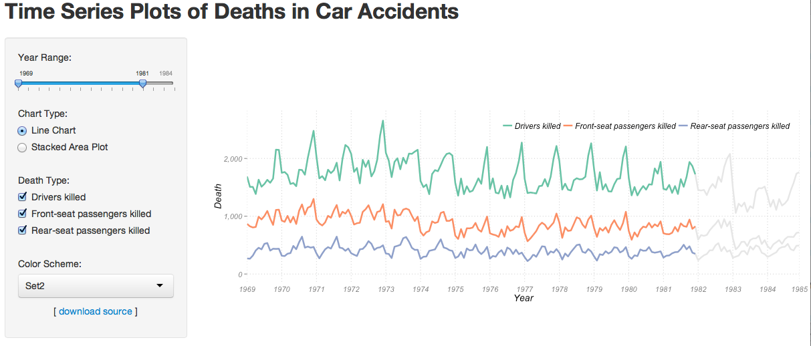
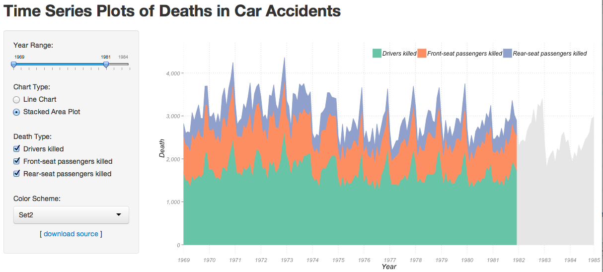

Visualization: Time Series
==============================

| **Name**  | Katherine Zhao  |
|----------:|:-------------|
| **Email** | mzhao12@dons.usfca.edu |

## Instructions ##

The following packages must be installed prior to running this code:

- `ggplot2`
- `shiny`
- `scales`
- `RColorBrewer`
- `reshape2`

To run this code, please enter the following commands in R:

```
library(shiny)
shiny::runGitHub('DataVisualization', 'katherinez22', subdir = 'Visualize_Time_Series')
```

This will start the `shiny` app. See below for details on how to interact with the visualization.

## Data Set ##

The data set I used for this visualization is Road Casualties in Great Britain from 1969 to 1984. For more information about this dataset, please search `?Seatbelts` in `R`.

## Discussion ##

In this visualization, I tried to visualize the number of deaths over time when people sit in different places in the car. By having `drivers`, `front`, and `rear` columns in my original data, I can visulize the time series for `Drivers killed`, `Front-seat passengers killed`, and `Rear-seat passengers killed`, respectively.

### Interactivity ###

In the shiny app, users can choose the time frame which they would like to see the time series of the data. To do so, just simply slide the bar of `Year Range`. `Chart Type` allows users to switch between the line plot and stacked area plot. By choosing different `Death Type`, users can view the time series of people killed when sitting in the various places in a car. Users can also view the plots with different color scheme by selecting one color in the `Color Scheme`. Lastly, users can download the source code by clicking on the `download source`.



By viewing the time series in line plot above, we can see there are very steady time series of three death types in every year. A peak can be found at the end of each year during the holiday season. Also, the number of deaths in the car accidents starts increasing in the second half of a year, especially in the winter. By comparing the shapes of the time series of three death types, we can find they have similar shapes. 



By viewing the stacked area plot, we can see the number of drivers killed is the largest proportion of the total number of people deaths in car accidents. Also, we can find rear seats seem to be more safe than other seats in a car. 

### Customization ###

In both plots, I adjusted various parameters in the theme, such as `legend.direction`, `legend.position`, `text`, `panel.border` and etc. In order to remove the spaces between year 1984 and 1985, I rescaled the years setting the `limits` in `scale_x_continuous` from 1969 to 1984+0.917. Also, I fixed scale coordinate system to force a specified ratio between the physical representation of data units on the axes using `coord_fixed`. Brushing technique was implemented by drawing grey lines/areas with all the time data as the back ground and then drawing the colored lines/areas for filted data on the top. 
