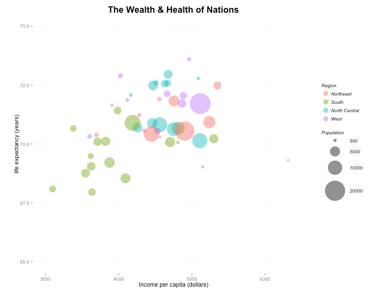
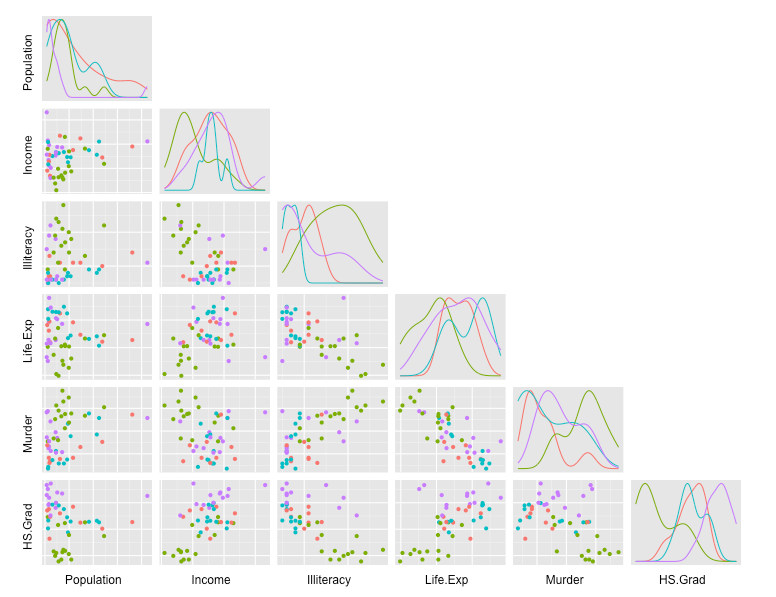
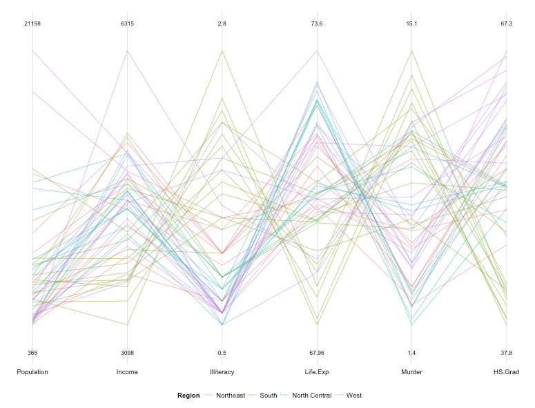
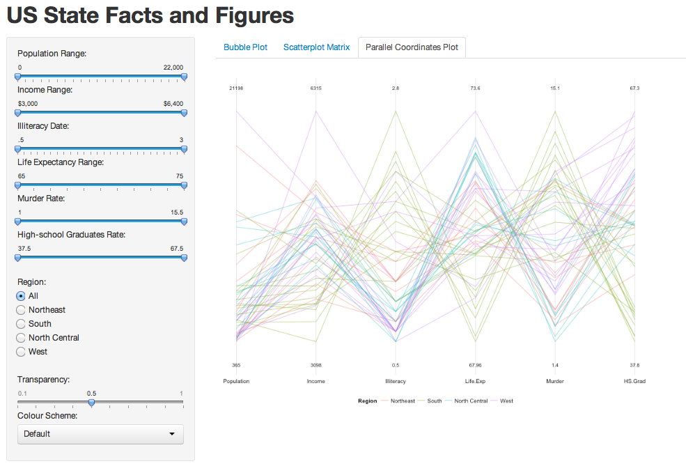

Visualization: US State Facts and Figures 
==============================

| **Name**  | Katherine Zhao  |
|----------:|:-------------|
| **Email** | mzhao12@dons.usfca.edu |

## Instructions ##

The following packages must be installed prior to running this code:

- `ggplot2`
- `shiny`
- `GGally`

To run this code, please enter the following commands in R:

```
library(shiny)
shiny::runGitHub('DataVisualization', 'katherinez22', subdir = 'homework3')
```

This will start the `shiny` app. See below for details on how to interact with the visualization.

## Data Set ##

In this project, I visualized US State Facts and Figures dataset that built in `datasets` package in `R`. For more information about this dataset, please search `?state` in `R`.

## Discussion ##

### Technique 1: Bubble Plot ###

This plot shows the wealth and health of the United States. x-axis is the income per capita in dollars and y-axis is the life expectancy in years. 

By using different color for each region, the plot shows the wealth vs. health within each region. In addition, bubble size represents the size of population. In general, Bubble Plot is a good technique to use and it also shows how income and life expectancy are effected by the sizes of population. 




### Technique 2: Scatter Matrix ###

This plot shows the scatter matrix of 6 variables: Populatio, Income, Illiteracy, Life Expectancy, Murder and High School Graduation Rate. 

By using different color for each region, the plot allows audience to explore the relationship between variables and find out some interesting insights within each region. These insights also help us with setting initial hypothesis for further analysis.




### Technique 3: Parallel Coordinates Plot ###

This plot shows the data from each state as one line and the trends of data between different variables. Here, 6 variables, Populatio, Income, Illiteracy, Life Expectancy, Murder and High School Graduation Rate, are selected.




### Interactivity ###

By choosing different value ranges of 6 vairables, the three techniques will plot subsets of data. Also, by selecting different regions, the graphs will only show the plots of corresponding region. In addition, `Transparancy` controls both transparancy of dots and transparancy of lines. 



